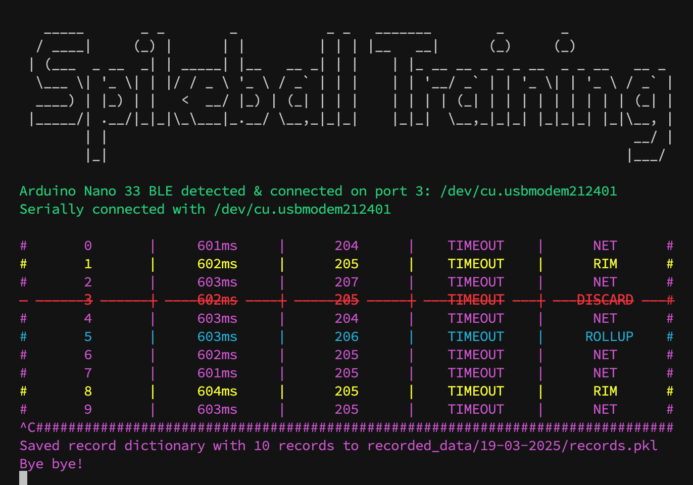

# Data collector

This Python script connects to an MCU via serial communication, reads accelerometer data sent by the `SendAcceleration` Arduino sketch, saves it to CSV files and plots a graph of the recorded accelerations. It provides an easy-to-use CLI with the ability to use keystrokes to label incoming datasets.

## Screenshot of the CLI

## Dependencies

- Python 3.11
- See `requirements.txt`

## Setup

1.  Make sure the Arduino is connected to your computer and the `SendAcceleration` sketch is running.
2.  (Optional) Create and activate a virtual python environment via `python -m venv .venv && source .venv/bin/activate`
3.  Install the required dependencies via `pip install -r requirements.txt`

## Usage

1.  Run the script: `python main.py`. It should detect the Arduino Nano 33 automatically, otherwise it will ask you for which device to connect.
2.  The script will allow you to enter the type of hit (r → "rim",n → "net",u → "rollup" or d → "discard") for each data recording. When no keystroke is received, the script will always assume net.
3.  The collected data will be saved to CSV files in the `recorded_data` directory under the corresponding subdirectories.
4.  Once done with a recording session, hit CRTL+C multiple times to exit the script. It will save the recording state and you simply continue by starting the script again.
5.  When recording a new session, you'll want to rename the existing `recorded_data` folder before starting the script again.

## Helpful features

- When you collected a series of false datasets (this happens if a player needs to lift or move the net) you can delete those by inputting the hit ID since the false recordings. It will discard all hits from this ID to the most recent one (included)

## Notes & Future development

- I created this code iteratively, and so this codebase grew onto what it is now. I am aware that this code is neither organized nor modular. This should be fixed, however i see little point in doing that.
- The graph plotting opening a new browser tab each time is not a clean solution, it should be reworked or disabled.
- It might be more user-friendly to migrate the sampling logic to the MCU and send the data via BLE. With that architecture, no long cable would be needed and one could use a WebApp for the data recording part. On the negative side, BLE would take ~30ms to transmit, which could make recording datasamples while transmitting a challenge.
